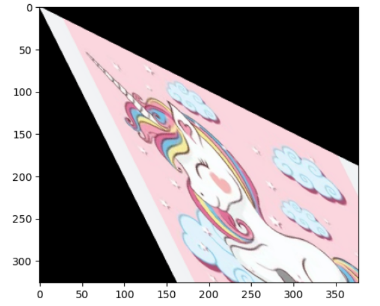

# Image-Transformation
## Aim
To perform image transformation such as Translation, Scaling, Shearing, Reflection, Rotation and Cropping using OpenCV and Python.

## Software Required:
Anaconda - Python 3.7

## Algorithm:
### Step1:
Import the necessary libraries and read the original image and save it a image variable.

### Step2:
Translate the image using Translation_matrix=np.float32([[1,0,120],[0,1,120],[0,0,1]]) Translated_image=cv2.warpPerspective(org_img,Translation_matrix,(col,row))

### Step3:
Scale the image using Scaling_Matrix=np.float32([[1.2,0,0],[0,1.2,0],[0,0,1]]) Scaled_image=cv2.warpPerspective(org_img,Scaling_Matrix,(col,row))

### Step4:
Shear the image using Shearing_matrix=np.float32([[1,0.2,0],[0.2,1,0],[0,0,1]]) Sheared_image=cv2.warpPerspective(org_img,Shearing_matrix,(col2,int(row1.5)))

### Step5:
Reflection of image can be achieved through the code Reflection_matrix_row=np.float32([[1,0,0],[0,-1,row],[0,0,1]]) Reflected_image_row=cv2.warpPerspective(org_img,Reflection_matrix_row,(col,int(row)))
### step6:
 Rotate the image using Rotation_angle=np.radians(10) Rotation_matrix=np.float32([[np.cos(Rotation_angle),-np.sin(Rotation_angle),0], [np.sin(Rotation_angle),np.cos(Rotation_angle),0], [0,0,1]]) Rotated_image=cv2.warpPerspective(org_img,Rotation_matrix,(col,(row)))

 ### step7:
  Crop the image using cropped_image=org_img[10:350,320:560]

  ### step8:
  Display all the Transformed images.


## Program:
```python
Developed By:Meiyarasi.V
Register Number:212221230058
import cv2
import matplotlib.pyplot as plt
I = cv2.imread("unicon.jpeg")
I = cv2.cvtColor(I,cv2.COLOR_BGR2RGB)
plt.axis('off')
plt.axis('off')
plt.imshow(I)
plt.show()
i)Image Translation

rows,cols,dim = I.shape
import numpy as np
N = np.float32([[1,0,100],
                [0,1.9,200],
                [0,0,1]])
translated_image = cv2.warpPerspective(I,N,(cols,rows))
plt.imshow(translated_image)

ii) Image Scaling

rows,cols,dim = I.shape
N = np.float32([[2,0,0],
               [0,3,0],
               [0,0,1]])
               scaled_img = cv2.warpPerspective(I,N,(cols*2,rows*2))
plt.imshow(scaled_img)

iii)Image shearing

M_xy = np.float32([[1,0.5,0],
                   [0.5,1,0],
                   [0,0,1]])
shearedimage_xyaxis = cv2.warpPerspective(I,M_xy,(int(cols*1.5),int(rows*1.5)))
plt.imshow(shearedimage_xyaxis)

iv)Image Reflection

rows,cols,dim = I.shape
R_xy = np.float32([[1,0,cols],
                [0,-1,rows],
                [0,0,1]])
reflected_image_xyaxis = cv2.warpPerspective(I,M_xy,(int(cols),int(rows))
plt.imshow(reflected_image_xyaxis)

v)Image Rotation

rows,cols,dim = I.shape
angle = np.radians(15)
RO = np.float32([[np.cos(angle),-(np.sin(angle)),0],
               [np.sin(angle),np.cos(angle),0],
               [0,0,1]])
rotated_image= cv2.warpPerspective(I,RO,(int(cols),int(rows)))
plt.imshow(rotated_image)

vi)Image Cropping
rows,cols,dim = I.shape
cropped_img = I[100:300,100:300]
plt.imshow(cropped_img)

```
## Output:
### original image


### i)Image Translation


### ii) Image Scaling


### iii)Image shearing


### iv)Image Reflection


### v)Image Rotation


### vi)Image Cropping


## Result: 

Thus the different image transformations such as Translation, Scaling, Shearing, Reflection, Rotation and Cropping are done using OpenCV and python programming.
